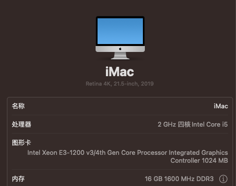

# Lenovo-M73-Hackintosh

***

记录一下这次升级Ventura13.0的注意事项，及现在使用的EFI

| Component | Model                                                                                   |
| --------- | --------------------------------------------------------------------------------------- |
| CPU       | Intel(R) Core(TM) i5-4590T CPU @ 2.00GHz                                                |
| RAM       | 16 GB 1600 MHz DDR3                                                                     |
| GPU       | Intel Xeon E3-1200 v3/4th Gen Core Processor Integrated Graphics Controller 1024 MB（仿冒） |

1.需要在NVRAM中的boot-args里添加amfi\_get\_out\_of\_my\_way=1和ipc\_control\_port\_options=0这两条配置

2.然后重置NVRAM，等待读条开机，此时开机后，显存为5M

3.[https://github.com/dortania/OpenCore-Legacy-Patcher](https://github.com/dortania/OpenCore-Legacy-Patcher "https://github.com/dortania/OpenCore-Legacy-Patcher"),之后去下载补丁，点击post install root patch，等待重启

